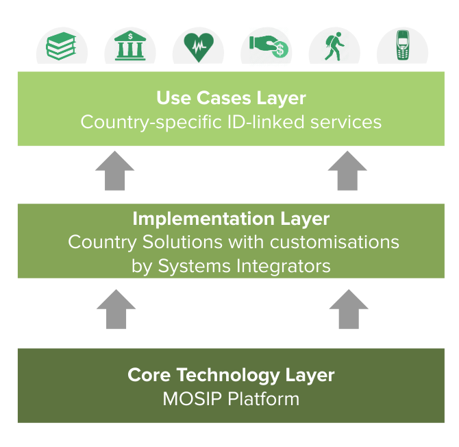

# Architecture

**Note on documentation**: Information on the mosip architecture and design are distributed between [MOSIP Documentation](https://github.com/harshita-gupta/documentation/tree/2e41365e7cde5a51930f8edce354b5dc659fd4c2/docs/docs.mosip.io) and the design folders of the various [repositories](https://github.com/mosip).

As the world races towards a fully digital economy, foundational ids and id systems become an essential building block in establishing digital trust. They are also an essential part of Government to People \(G2P\) initiatives. MOSIP as a foundational ID plaform delivers a key ingredient of the fabric of digital governance systems.

Pillars of a digital future

* Digital Identity and Trust
* Interoperability and Standards
* Transparency and Auditability

  The above allow systems to enact digital transactions which are essentially flow of all forms of data or money. These transactions will need to factor identity assurance, consent, user privacy, and information security. MOSIP offers identity assurance to such transactions.

## Building a National ID System using MOSIP

National ID systems can leverage MOSIP as the base platform and configure, customize, extend it to build their systems just they way the need it. The picture below depicts how mosip is visualized as a national id platform.

